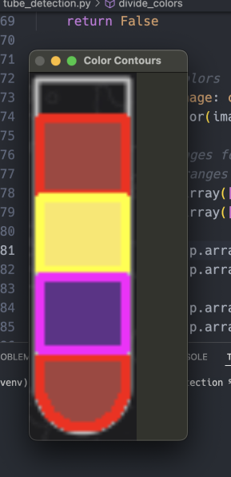
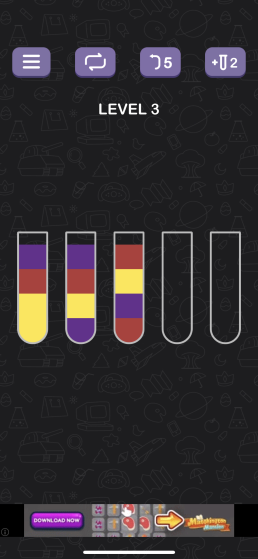

# Solving the Water Sort Game Programmatically

This is a blog post done purely in spite.

Water sort is the name of a number of mobile games in which you have to sort the same liquids in one container as a puzzle.

<p align="center">

</p>


I play the game  in the rare case that I don't have an internet connection, but unfortunately to me it seems that I am pretty slow at it. I noticed that the puzzle and the way you solve it is pretty reminiscent of backtracking so thats where I started.


## Backtracking with haskell

I have been recently trying to learn haskell and so I thought that this was a pretty good opportunity to use it (please be kind haskell gods).

Initially I noticed that the way of liquids being poured resembled a stack so thats what I went with and the data structures were:

```haskell
type Index = Int

data Color = Yellow | Blue | Purple | Orange | Green | Red | DarkGreen | Gray | Coffee | Pink | LightGreen | DarkBlue | Cream deriving (Show, Eq, Ord)

type Move = (Index, Index)

data ColorSegment = ColorSegment Color Int deriving (Show, Eq, Ord)

data Container = Container Index (Stack ColorSegment) deriving (Eq, Show, Ord)

type Containers = [Container]

type Answer = [Move]

```

Stack doesnt seem to exist on the base library but it was simple enough to implement.

I understand that in this case I have to do some pruning on moves even though going through all possibilties could be possible (given that these games at most usually have 9 containers and usually 4 color blocks inside them).

Calculating the valid moves after every move:

```haskell
getValidMoves :: Containers -> [Move]
getValidMoves containers =
  [getIndexes f s | f <- containers, s <- containers, isValidMove f s]
  where
    getIndexes (Container v1 _) (Container v2 _) = (v1, v2)

containerhasSpace :: Container -> Container -> Bool
containerhasSpace (Container _ (Stack (ColorSegment _ e : _))) (Container _ (Stack colors)) = calculateColors colors + e <= maximumColors
containerhasSpace (Container _ (Stack [])) _ = False

sameTopColors :: Container -> Container -> Bool
sameTopColors (Container _ (Stack ((ColorSegment color1 _) : _))) (Container _ (Stack ((ColorSegment color2 _) : _))) = color1 == color2
sameTopColors (Container _ (Stack [])) _ = False
sameTopColors (Container _ (Stack _)) (Container _ (Stack [])) = True

uselessEmptyMove :: Container -> Container -> Bool
uselessEmptyMove (Container _ (Stack colors)) (Container _ (Stack [])) = length (nub colors) == 1
uselessEmptyMove _ _ = False

isValidMove :: Container -> Container -> Bool
isValidMove firstContainer secondContainer =
  (firstContainer /= secondContainer)
    && sameTopColors firstContainer secondContainer
    && containerhasSpace firstContainer secondContainer
    && notDoneContainers
    && not (uselessEmptyMove firstContainer secondContainer)
  where
    notDoneContainers = not $ any isFilledContainer [firstContainer, secondContainer]
```
At some point the destructuring becomes a bit more unbearable, but as I understand record syntax and then [lens](https://hackage.haskell.org/package/lens-tutorial-1.0.5/docs/Control-Lens-Tutorial.html) are a remedy.


And then the main solving function:

```haskell
solveGame :: Containers -> Maybe Answer
solveGame containers = dfs containers (Just []) Set.empty

dfs :: Containers -> Maybe Answer -> Visited -> Maybe Answer
dfs containers solution visited
  | null solution = Nothing
  | isGameOver containers = solution -- Found a solution
  | containers `Set.member` visited = Nothing -- Prune if the state has been visited
  | otherwise = exploreMoves possibleMoves updatedVisited
  where
    possibleMoves = getValidMoves containers
    updatedVisited = Set.insert containers visited

    exploreMoves :: [Move] -> Visited -> Maybe Answer
    exploreMoves [] _ = Nothing -- No more moves to explore
    exploreMoves (move : moves) visited' =
      let newContainers = performMove containers move
          newSolution = fmap (\s -> s ++ [move]) solution
       in case dfs newContainers newSolution visited' of
            Just answer -> Just answer
            Nothing -> exploreMoves moves visited'

```


I added a set to remove already visited container states in which I know that they wont yield in a result but honestly that didnt seem to make much of a difference.

This code in the end gave me the indexes and the order in which I had to click the containers:

```
[(0,12),(0,13),(6,12),(7,0),(1,7),(2,1),(2,13),(2,6),(8,0),(10,8),(4,10),(11,4),(2,11),(4,2),(6,2),(9,6),(11,4),(3,11),(3,9),(12,3),(1,12),(10,1),(10,11),(10,12),(1,10),(1,13),(5,1),(7,1),(7,0),(11,7),(1,11),(5,1),(6,1),(5,6),(3,5),(3,6),(4,3),(4,6),(8,4),(8,3),(5,8),(9,4),(9,5),(5,12),(9,10)]
```

Solving it was complete, but by the time I actually executed the input everybody was much faster on completing it manually, so this software was still useless.

## Processing the game with openCV

The next step was reading the input through an image and generating some json input for the haskell script to process.


Given I am unfamiliar with image processing my first idea was to check on object detection and from my reading  I understood that required building a cascade classifier.

Before that I tried working with cv2's findContours functionality first and that seemed to be the easier and simple approach.

Initially I had to find the base containers and that was simple enough:

```python
def get_bounds_of_same_size(image: cv2.typing.MatLike) -> List[cv2.typing.Rect]:
    all_contours = get_contours(image)
    bounds_of_same_size = []
    contour_bounds = find_contour_bounds(all_contours)
    mean, deviation = get_bound_mean_and_deviation(contour_bounds)
    contour_aeras = [width * height for (_, _, width, height) in contour_bounds]
    for contour_bound, area in zip(contour_bounds, contour_aeras):
        if abs(area - mean) <= CONTAINER_TOLERANCE * deviation:
            bounds_of_same_size.append(contour_bound)
    return bounds_of_same_size

```

With this I  got all contours found and then by calculating the mean and deviation I was able to filter and find only the contours I needed. This might have been flaky with the base image but cropping the top and bottom made this work easily.

### Finding the colors inside the containers

Finding the colors should have been pretty easy in theory, by just again processing the image and finding the contours inside of it, but no matter which processing technique I tried I was never able to quite get the bounds of the color blocks. Maybe someone with more experience in this can enlighten me in which technique I should have used for finding it with contours in a resilient way.

My second idea was using "cv2.inRange" which took HSV color boundaries and would be able to find these regions.


After processing the result looked like this:

<p align="center">

</p>


[A stackoverflow article was my saviour here in defining the bounds](
https://stackoverflow.com/questions/10948589/choosing-the-correct-upper-and-lower-hsv-boundaries-for-color-detection-withcv)


After this was done I had to sort them by position which thankfully the function "cv2.boundingRect" gives and then had to ratio them based on area since the color I found in range could be 1 to 4 blocks.


```python
for (x, y, h, w), color in flattened:
    colors_with_positions.append((x, y, h, w, color))

sorted_colors = sorted(colors_with_positions, key=lambda item: item[1])


result = []
for _, _, h, w, color in sorted_colors:
    repetition_count = max(1, (h * w) // ratio)
    result.extend([color] * repetition_count)

```

This in the end for the image:

<p align="center">

</p>

Gave me the result of:

```javascript

[
  {
    "colors": [
      "purple",
      "red",
      "yellow",
      "yellow"
    ],
    "center": [
      66,
      48
    ]
  },
  {
    "colors": [
      "purple",
      "red",
      "yellow",
      "purple"
    ],
    "center": [
      90,
      48
    ]
  },
  {
    "colors": [
      "red",
      "yellow",
      "purple",
      "red"
    ],
    "center": [
      114,
      48
    ]
  },
  {
    "colors": [],
    "center": [
      138,
      48
    ]
  },
  {
    "colors": [],
    "center": [
      162,
      48
    ]
  }
]


```

The center coordinates will be needed for the next step

## Automating the game through an emulator

In this last step we come to my previous issue that playing the game manually is too slow and still defeats the purpose.

Thats why in this case the final step is starting up an android emulator and automating the game being played.

Communicating through the emulator is done through adb and thankfully it provides all we need like:

* screenshoting
```
adb exec-out screencap -p > screen.png
```
* simulating clicks
```
adb shell input tap x y
```

I also used python here as the glue of the whole thing, executing these shell commands in the end to play the game.

And that's all there is to it!

The conclusion of this post? I am still shit at the game.


